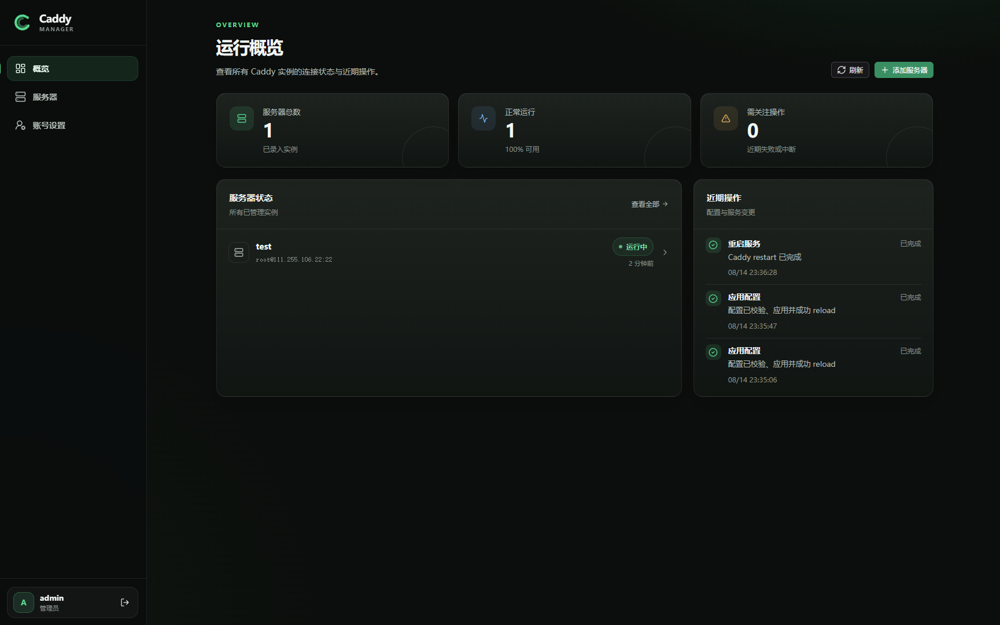
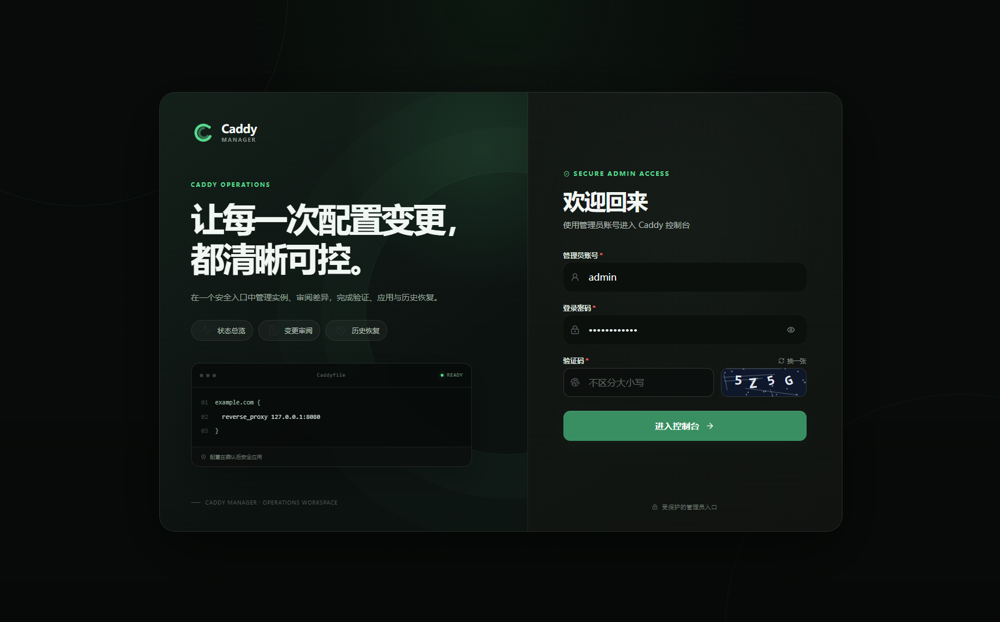
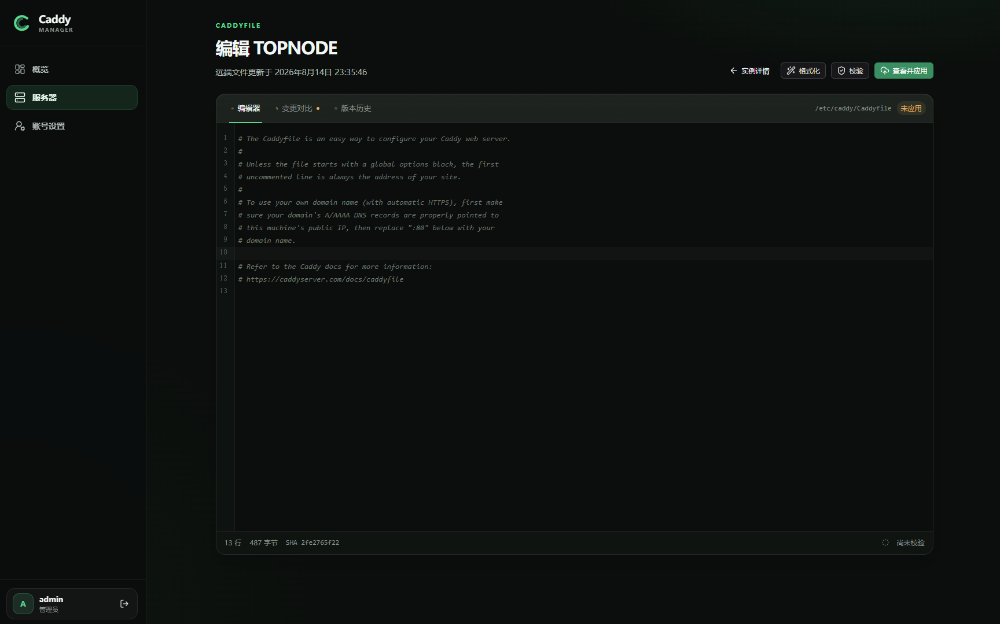

<div align="center">

# Caddy Manager

**通过一个安全、清晰的 Web 控制台，集中管理多台 Linux 服务器上的 Caddy。**

[](https://github.com/0xddy/caddy-mgr/actions/workflows/ci.yml)
[](https://hub.docker.com/r/0xddy/caddy-mgr/tags)
[](https://hub.docker.com/r/0xddy/caddy-mgr)
[](https://hub.docker.com/r/0xddy/caddy-mgr/tags)

[快速部署](#docker-部署) · [产品预览](#产品预览) · [Docker Hub](https://hub.docker.com/r/0xddy/caddy-mgr)

</div>

## 产品预览

### 运行概览



<table>
  <tr>
    <td width="50%" align="center"><strong>安全登录</strong></td>
    <td width="50%" align="center"><strong>Caddyfile 编辑器</strong></td>
  </tr>
  <tr>
    <td></td>
    <td></td>
  </tr>
</table>

## 核心能力

- **多服务器总览**：集中查看 Caddy 实例状态、近期操作与待处理事项。
- **SSH 自动探测**：识别远端 Linux 主机上的 systemd Caddy 服务与 Caddyfile，支持密码和私钥认证。
- **安全的主机校验**：首次连接显示 SSH 主机指纹，确认后持续校验，避免连接到错误主机。
- **可控配置变更**：在线编辑、格式化、校验并对比 Caddyfile，确认后再应用配置。
- **版本历史与恢复**：保留配置修订记录，可查看历史内容并恢复到指定版本。
- **服务运维操作**：在控制台中查看状态、重载或重启远端 Caddy 服务。
- **容器化部署**：官方镜像发布至 [Docker Hub](https://hub.docker.com/r/0xddy/caddy-mgr)，Compose 一条命令即可启动。

## Docker 部署

### 环境要求

- Docker Engine 与 Docker Compose `2.23.1+`
- 可解析到部署服务器的域名
- 对公网开放 TCP `80`、`443`

下载 Compose 配置：

```bash
curl -fsSLO https://raw.githubusercontent.com/0xddy/caddy-mgr/main/docker-compose.yaml
```

创建 `.env`：

```dotenv
# 域名、公网 IPv4，或带方括号的 IPv6；不要包含 https://
SITE_ADDRESS=caddy.example.com

# admin 的初始密码，至少 12 个字符
INITIAL_ADMIN_PASSWORD=change-this-password

# 使用 IPv6 时可额外指定 TLS SNI
# TLS_SERVER_NAME=2001:db8::10
```

启动服务：

```bash
docker compose up -d
```

打开 `https://<SITE_ADDRESS>`，使用用户名 `admin` 和设置的初始密码登录。Caddy 会自动申请并续期 HTTPS 证书。

> [!IMPORTANT]
> 应用数据、加密密钥和证书保存在 Docker volumes 中。请妥善备份，且不要执行 `docker compose down -v`。

## 更新与维护

```bash
# 查看日志
docker compose logs -f

# 拉取最新镜像并重建容器
docker compose pull
docker compose up -d

# 停止服务（保留数据卷）
docker compose down
```

镜像地址：[`0xddy/caddy-mgr`](https://hub.docker.com/r/0xddy/caddy-mgr)

## 本地开发

需要 Node.js `24` 与 pnpm `11`：

```bash
pnpm install
pnpm dev
```

提交前可运行：

```bash
pnpm typecheck
pnpm test
pnpm lint
```

## 适用范围

当前版本面向使用 **Linux + systemd + Caddyfile** 的 Caddy 实例。远端 SSH 凭据会加密保存，生产环境请同时保护数据卷、主密钥和管理员密码。
